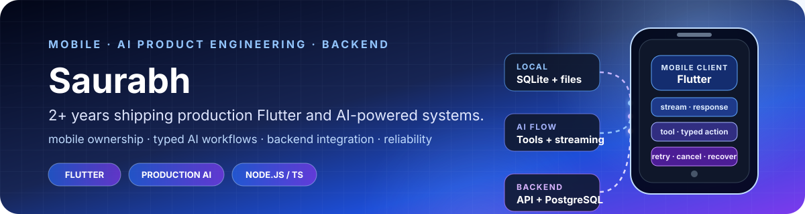
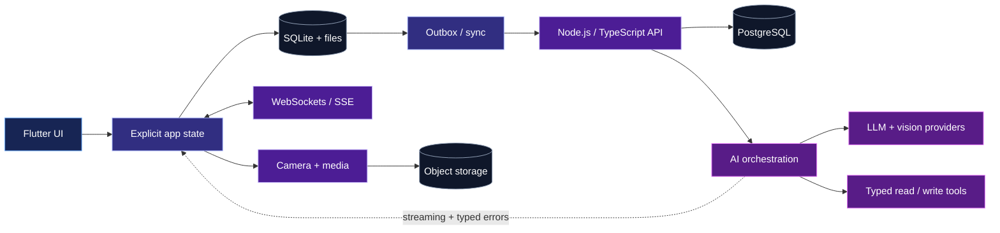

  

  
  
  

  
  

PRODUCTION CONTEXT AT RESHAPE

<table>
  <tr>
    <td width="25%" align="center"><strong>100K+</strong> mobile installs</td>
    <td width="25%" align="center"><strong>1.2M+</strong> meals logged</td>
    <td width="25%" align="center"><strong>133K+</strong> AI coach messages</td>
    <td width="25%" align="center"><strong>80+</strong> typed AI actions</td>
  </tr>
</table>

## What I can own

I build product flows that cross the mobile/backend boundary. My work does not stop at a screen: I follow state through local persistence, APIs, asynchronous execution, AI providers, databases, telemetry, tests, and production failure recovery.

<table>
  <tr>
    <td width="50%" valign="top">
      <strong>End-to-end mobile delivery</strong> 
      Flutter architecture, state management, native integrations, local data, networking, performance, and release-ready UX.
    </td>
    <td width="50%" valign="top">
      <strong>Production AI workflows</strong> 
      Multimodal input, structured schemas, typed tool execution, streaming, cancellation, retries, and provider failure handling.
    </td>
  </tr>
  <tr>
    <td width="50%" valign="top">
      <strong>Reliability under failure</strong> 
      Offline-first persistence, idempotent operations, durable outboxes, lifecycle recovery, caching, and observable terminal states.
    </td>
    <td width="50%" valign="top">
      <strong>Backend and data boundaries</strong> 
      Node.js/TypeScript services, API contracts, PostgreSQL, MongoDB, Redis, background workers, cloud infrastructure, and tests.
    </td>
  </tr>
</table>

## Production engineering highlights

| System | What I delivered | Signal |
| --- | --- | --- |
| **Multimodal meal logging** | Owned mobile architecture across photo, text, and voice analysis; moved execution into client/backend workflows with streaming state, background work, retries, cancellation, and recovery. | **1.2M+ meals**; client-side failures reduced **10%** |
| **Fio AI coach** | Built the Flutter tool-execution layer that converts structured model output into contextual read/write actions across health domains. | **133K+ messages**, **11.8K users**, **80+ actions**; workflow errors down ~**30%**, latency down **50%** |
| **Workout product** | Redesigned tracking flows, state management, analytics visualizations, and supporting data behavior. | Workout-section retention improved **60%** |
| **Social and media** | Delivered cursor pagination, optimistic interactions, persistent outboxes, WebSocket activity, privacy controls, protected media, viewport-aware caching, and tests. | Production system supporting **26K+ posts** |
| **Personalized weekly report** | Built an interactive cross-domain report with cached Home states, PDF export, experiment rollout, persisted feedback, and widget tests. | Mobile + backend feature delivered across product, data, and feedback boundaries |

## How the pieces connect

## Open-source proof

### [RythmRun](https://github.com/cosmicsaurabh/RythmRun) — offline-first GPS workout system

`Flutter` · `Riverpod` · `SQLite` · `TypeScript` · `Express` · `PostgreSQL` · `Prisma` · `Cloudflare R2`

- Commits completed workouts, accepted route points, and status history in one SQLite transaction before synchronization.
- Uses stable client-generated identities and PostgreSQL uniqueness so ambiguous HTTP retries cannot duplicate a workout.
- Applies a versioned GPS acceptance policy before calculating distance and pace.
- Persists image upload, replacement, and deletion as recoverable state machines.
- Documents architecture, failure semantics, tests, known boundaries, and accepted trade-offs.

  
  
  

### [LineLeap](https://github.com/cosmicsaurabh/LineLeap) — persistent AI generation workflow

`Flutter` · `Provider` · `GetIt` · `Hive` · `Stable Horde API` · `GitHub Actions`

- Models AI generation as a persistent queue with queued, submitting, generating, completed, failed, and retry states.
- Stores gallery metadata and generated images locally so completed work survives navigation and remains available offline.
- Tests drawing history and queue transitions and runs formatting, analysis, tests, and an Android build in CI.

  
  

## Technical range

  

| Area | Working set |
| --- | --- |
| **Mobile** | Flutter, Dart, Riverpod, Provider, SQLite, camera/media, background execution, Android/iOS integrations |
| **AI product engineering** | Multimodal input, model orchestration, structured schemas, function calling, typed tools, streaming, cancellation, failure recovery |
| **Backend and data** | Node.js, TypeScript, Express, PostgreSQL, Prisma, MongoDB, Redis, REST, WebSockets, SSE |
| **Quality and delivery** | Widget/integration tests, Jest, telemetry, feature flags, GitHub Actions, GCP, Azure, Firebase |

> AI accelerates my implementation, investigation, and review. I remain accountable for the problem definition, architecture, trade-offs, validation, and production outcome.

  
<strong>GitHub activity</strong>

   
  

    
  

---

  <strong>Hiring for mobile, Flutter, or AI product engineering?</strong> 
  I am interested in teams solving real product and reliability problems—not just shipping screens.  
  

